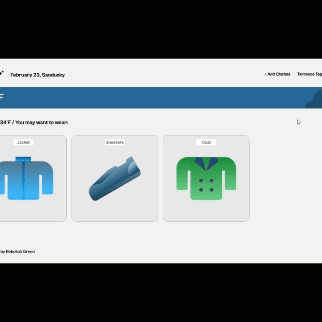
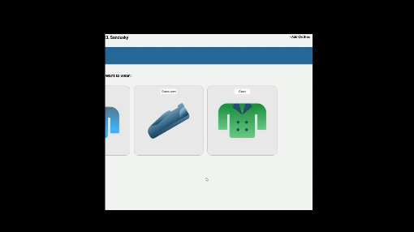

# React Project: WTWR

## Overview  

* [Description](#description)
* [Project Features](#project-features)
* [GitHub](#github-pages-link)
<!-- * [Video](#video-link) -->

## Description
### Languages Used:
* HTML5
* CSS3
* Javascript

The JS Library **React** is used to create a dynamic and interactive UI in accordance to the [Figma design](https://www.figma.com/design/F03bTb81Pw8IDPj5Y9rc5i/Sprint-10-%7C-WTWR?node-id=311-433&p=f&t=TUCoPogjlKxlYZ1a-0) from TripleTen. The weather elements are rendered using the [Open Weather API](https://openweathermap.org/api).

### Website Functionality

Users are able to filter and view clothing items based on the current weather at their location. Users can also add clothing items. 

1. Add Clothes

2. Preview Items

## Project Features

*TBA*

## GitHub
#### To view the repository:
https://github.com/RMGreen18/se_project_react

<!-- Currently, two official plugins are available:

- [@vitejs/plugin-react](https://github.com/vitejs/vite-plugin-react/blob/main/packages/plugin-react/README.md) uses [Babel](https://babeljs.io/) for Fast Refresh
- [@vitejs/plugin-react-swc](https://github.com/vitejs/vite-plugin-react-swc) uses [SWC](https://swc.rs/) for Fast Refresh -->
